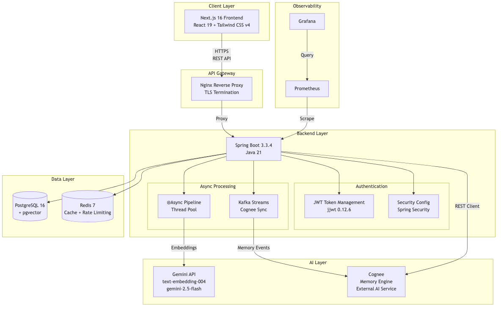
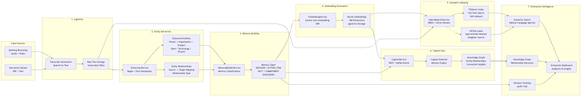
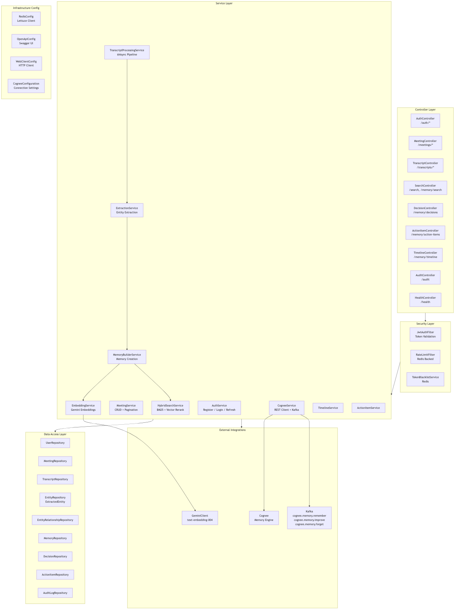
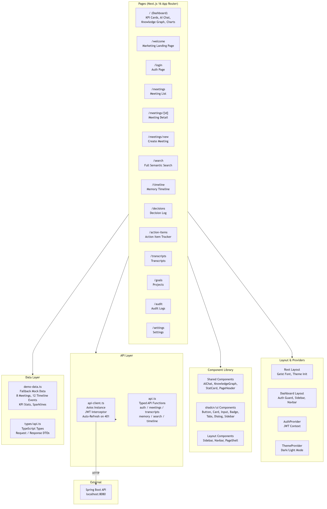

<p align="center">
  <picture>
    <source media="(prefers-color-scheme: dark)" srcset="assets/logo/logo.svg">
    
  </picture>
</p>

<h1 align="center">Memory Engine</h1>

<p align="center">
  <em>The Organizational Brain for Enterprise AI</em>
</p>

<p align="center">
  
  
  
  
  
  
  
  
</p>

<p align="center">
  <a href="#overview">Overview</a> •
  <a href="#problem">Problem</a> •
  <a href="#solution">Solution</a> •
  <a href="#features">Features</a> •
  <a href="#stack">Stack</a> •
  <a href="#structure">Structure</a> •
  <a href="#quickstart">Quick Start</a> •
  <a href="#screenshots">Screenshots</a> •
  <a href="#license">License</a>
</p>

<br>

---

<h2 id="overview">Overview</h2>

Memory Engine transforms meeting transcripts into a persistent organizational memory using Cognee, Knowledge Graphs and Hybrid Search. Instead of generating temporary AI responses, it builds a continuously evolving enterprise knowledge base that understands decisions, action items, relationships, commitments and historical context across teams.

<br>

<h2 id="problem">Problem</h2>

Organizations bleed context every day. Decisions made in meetings vanish the moment the call ends. Documents are scattered across tools. Teams repeat history because nobody remembers it.

| The Cost of Amnesia | Source |
|---------------------|--------|
| **$18.5M** annual knowledge loss per 1,000 employees | IDC |
| **5.3 hrs/week** wasted searching for information | McKinsey |
| **70%** of context lost when a key employee leaves | Gartner |
| **3.2x** slower decision-making without institutional memory | HBR |

Traditional tools treat each source as an isolated artifact — record, transcribe, summarize, archive, forget.

<br>

<h2 id="solution">Solution</h2>

```
  Ingest Source → Cognee AI → Knowledge Graph → Semantic Search → Continuous Intelligence
```

- **Ingest** meetings (Zoom, Google Meet, manual), documents, and conversations
- **Cognee** extracts entities, relationships, decisions, and action items using LLMs
- **Knowledge Graph** connects everything — people, projects, decisions, meetings
- **Semantic Search** query your organization's memory in natural language
- **Continuous Intelligence** every new source enriches the existing graph

<br>

<h2 id="features">Key Features</h2>

**Core:** Enterprise Memory, Semantic Search, Cognee AI Integration, Decision Intelligence, Action Tracking, Meeting Intelligence, Knowledge Graph Visualization, AI Chat, Activity Timeline, Analytics Dashboard

**Enterprise:** RBAC (Admin/Manager/Employee), JWT Auth with refresh rotation, Immutable Audit Trail, Rate Limiting, Prometheus Metrics, Kubernetes Health Probes, CORS Controls, PostgreSQL + pgvector, Redis Caching, Kafka Event Bus

**Deployment:** Docker Compose, Kubernetes with HPA (2–8 replicas), TLS via cert-manager, GitHub Actions CI/CD, Grafana + Prometheus Observability, Nginx Reverse Proxy

<br>

<h2 id="why-cognee">Why Cognee Instead of Traditional RAG?</h2>

| Capability | Traditional RAG | Cognee |
|------------|----------------|--------|
| Retrieval | Flat vector similarity | Graph-aware semantic retrieval |
| Context | Single document chunks | Multi-hop entity relationships |
| Memory | Stateless per query | Persistent knowledge graph |
| Understanding | Keyword + embedding | Entity extraction + relationship mapping |
| Decision tracking | Not supported | First-class with reasoning trails |
| Temporal awareness | None | Timeline-aware querying |
| Cross-source linking | Manual | Automatic graph construction |

<br>

<h2 id="architecture">Architecture</h2>

<table>
  <tr>
    <td align="center"><strong>System</strong><br></td>
    <td align="center"><strong>Knowledge Flow</strong><br></td>
  </tr>
  <tr>
    <td align="center"><strong>Backend Services</strong><br></td>
    <td align="center"><strong>Frontend Flow</strong><br></td>
  </tr>
</table>

See [`docs/architecture/`](docs/architecture/) for detailed architecture documentation.

<br>

<h2 id="stack">Technology Stack</h2>

| Category | Technologies |
|----------|-------------|
| **Backend** | Java 21, Spring Boot 3, Spring Security, Spring Data JPA, Hibernate, Maven, Flyway, Lombok, Jakarta Validation, Async Processing |
| **Frontend** | Next.js 15, React 19, TypeScript, Tailwind CSS, shadcn/ui, Framer Motion, Lucide React |
| **AI / LLM** | Cognee, Google Gemini, Knowledge Graph, Hybrid Search, Semantic Search, Vector Embeddings, Organizational Memory, Entity Extraction, Decision Engine, Action Item Engine, Timeline Engine |
| **Memory Layer** | Cognee Knowledge Graph, Persistent Organizational Memory, Entity Relationship Mapping, Graph Construction |
| **Search Engine** | BM25, Vector Search (pgvector), Cosine Similarity, Hybrid Fusion |
| **Authentication** | JWT (JJWT), RBAC (Admin / Manager / Employee), Refresh Token Rotation |
| **Database** | PostgreSQL 16 + pgvector, Redis 7, Kafka 4.0, Flyway Migrations |
| **DevOps** | Docker, Docker Compose, Kubernetes (HPA, Ingress, ConfigMap), Nginx, GitHub Actions |
| **Monitoring** | Prometheus, Grafana, Micrometer, Spring Actuator |
| **Documentation** | Swagger / OpenAPI (Springdoc), Architecture Diagrams, API Documentation |

<br>

<h2 id="structure">Project Structure</h2>

```
memory-engine/
├── backend/                          # Spring Boot 3 API (Java 21)
│   ├── src/main/java/com/mnemo/memoryengine/
│   │   ├── actionitem/  audit/  auth/  cognee/  common/  config/
│   │   ├── decision/  embedding/  extraction/  meeting/  memory/
│   │   ├── organization/  search/  security/  timeline/  transcript/  user/
│   ├── src/main/resources/          # Config + Flyway migrations
│   └── Dockerfile                   # Multi-stage, non-root
├── frontend/                         # Next.js 16 App Router
│   ├── src/app/                     # Dashboard, meetings, search, login, etc.
│   ├── src/components/              # Layout, shared, shadcn/ui primitives
│   ├── src/hooks/  src/lib/  src/providers/  src/types/
│   └── package.json
├── k8s/                              # ConfigMap, Deployment, Service, Ingress, HPA
├── docker/                           # Prometheus config
├── nginx/                            # Reverse proxy + certbot TLS
├── docs/
│   ├── api/                          # 6 API doc files
│   ├── architecture/                 # 10 markdown docs + 4 PNG diagrams
│   ├── deployment/                   # 4 deployment guides
│   └── screenshots/                  # 7 screenshots
├── docker-compose.yml                # Local dev stack
├── docker-compose.prod.yml           # Production overlay
└── .env.example                      # Configuration template
```

<br>

<h2 id="quickstart">Quick Start</h2>

### Local Development

```bash
# Start infrastructure (PostgreSQL, Redis, Kafka)
docker compose up -d postgres redis kafka

# Backend
cd backend && mvn clean package -DskipTests
java -jar target/memory-engine-0.1.0.jar     # → localhost:8080

# Frontend (separate terminal)
cd frontend && npm install && npm run dev     # → localhost:3000
```

### Docker Compose (Full Stack)

```bash
cp .env.example .env   # Edit: JWT_SECRET, GEMINI_API_KEY, DB_PASSWORD
docker compose up --build -d
```

### Kubernetes

```bash
kubectl create namespace memory-engine
kubectl create secret generic memory-engine-secrets \
  --from-literal=DB_PASSWORD='...' \
  --from-literal=JWT_SECRET='...' \
  --from-literal=GEMINI_API_KEY='...' \
  -n memory-engine
kubectl apply -f k8s/ -n memory-engine
```

See [`docs/deployment/local.md`](docs/deployment/local.md), [`docs/deployment/docker.md`](docs/deployment/docker.md), [`docs/deployment/kubernetes.md`](docs/deployment/kubernetes.md), and [`docs/deployment/production.md`](docs/deployment/production.md) for detailed guides.

<br>

<h2 id="api">API Documentation</h2>

| Module | Endpoints | Docs |
|--------|-----------|------|
| Authentication | Register, Login, Refresh, Logout | [`docs/api/authentication.md`](docs/api/authentication.md) |
| Meetings | List, Create, Get by ID | [`docs/api/meetings.md`](docs/api/meetings.md) |
| Memory | Search, Person, Project, Decisions, Action Items, Timeline | [`docs/api/memory.md`](docs/api/memory.md) |
| Search | Hybrid search (vector + graph) | [`docs/api/search.md`](docs/api/search.md) |
| Knowledge Graph | Graph queries and visualization | [`docs/api/knowledge-graph.md`](docs/api/knowledge-graph.md) |
| Health | Health check for k8s probes | [`docs/api/health.md`](docs/api/health.md) |

All endpoints return: `{ "success": true, "data": {}, "message": "...", "timestamp": "..." }`

<br>

**Current:** Meeting ingestion, Entity extraction, Knowledge graph, Semantic search, Decision intelligence, Action items, Activity timeline, Dashboard, AI Chat, JWT + RBAC, Audit, Docker Compose, Kubernetes, CI/CD, Monitoring

**Upcoming:** Slack integration, Notion/Google Drive connectors, Real-time decision collaboration, Graph analytics, Custom LLM support, Webhooks, Multi-language extraction, SSO/SAML, Data export

**Future:** Agentic workflows, Temporal knowledge reasoning, Federated graphs, Mobile apps, Air-gapped deployment, Custom model training, Knowledge versioning, GraphQL API

<br>

<h2 id="contributing">Contributing</h2>

1. Fork the repo
2. Create a feature branch: `git checkout -b feature/my-feature`
3. Commit: `git commit -m 'Add my feature'`
4. Push: `git push origin feature/my-feature`
5. Open a Pull Request

```bash
cd backend && mvn clean verify     # Backend tests
cd frontend && npm run lint         # Frontend lint
```

<br>

<h2 id="license">License</h2>

MIT

<br>

<h2 id="author">Author</h2>

<p align="center">
  <strong>Aditya Agrawal</strong><br>
  Backend Java Full Stack Developer<br><br>
  <a href="https://github.com/Aaditya022">GitHub</a>
</p>

<br>

---

<p align="center">
  ⭐️ Star this repository if you find it valuable.<br>
  <em>Your organization deserves a memory.</em>
</p>
