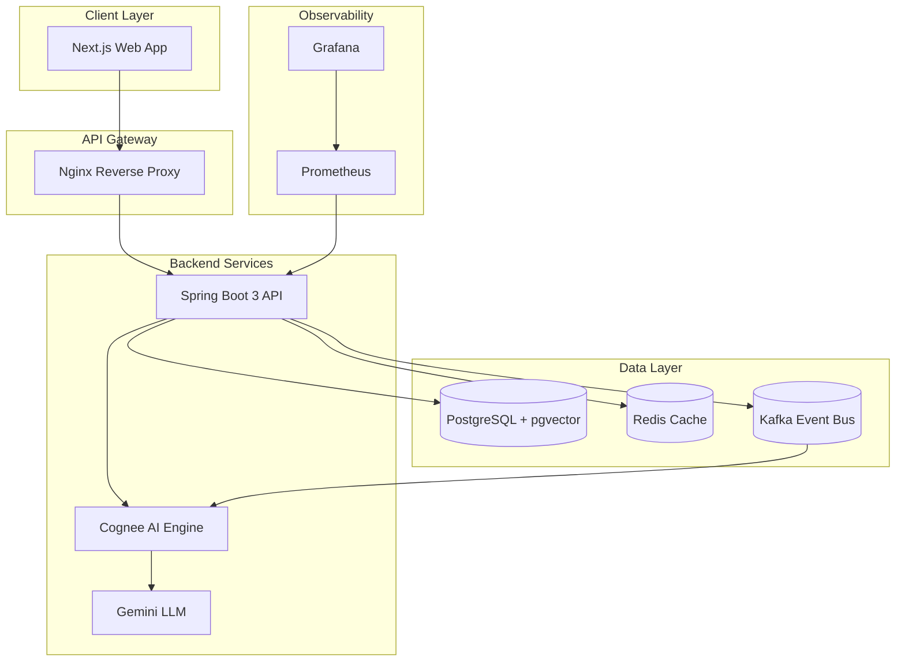
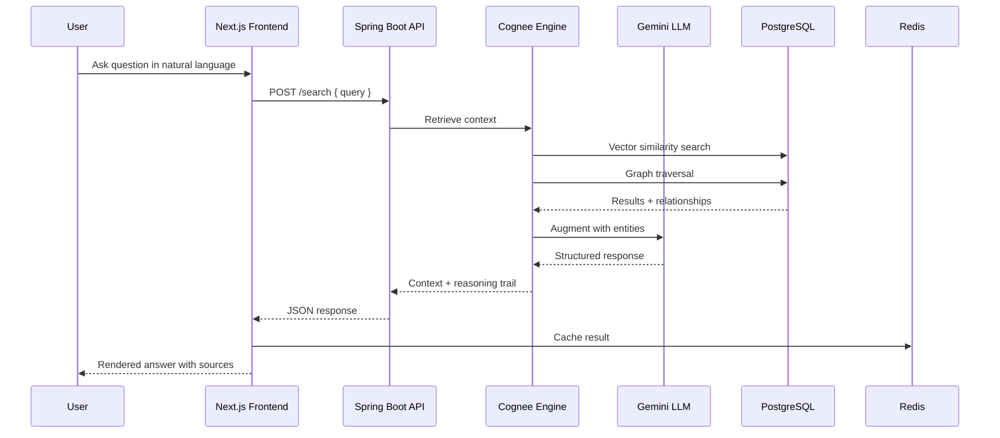
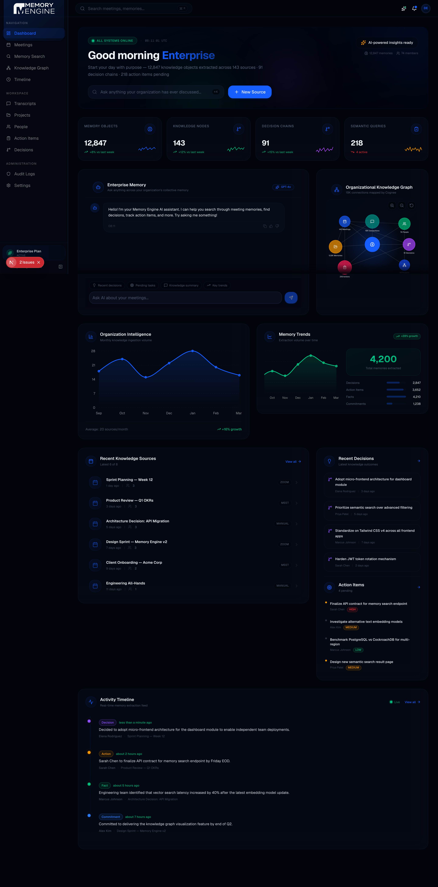
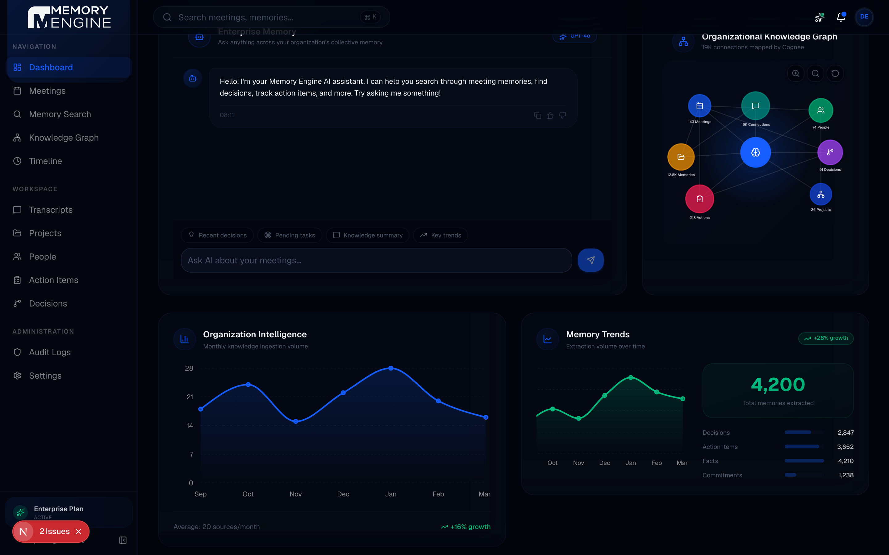
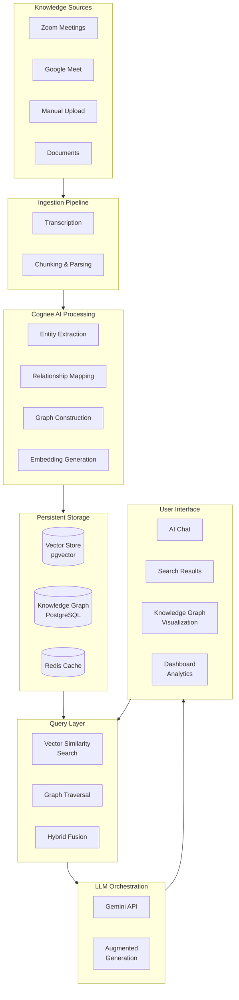

<p align="center">
  <picture>
    <source media="(prefers-color-scheme: dark)" srcset="docs/assets/banner.png">
    
  </picture>
</p>

<p align="center">
  <em>The Organizational Brain for Enterprise AI — Every decision, conversation, and document becomes permanently queryable.</em>
</p>

<p align="center">
  <a href="https://github.com/anomalyco/memory-engine/releases"></a>
  <a href="https://github.com/anomalyco/memory-engine/actions"></a>
  <a href="#"></a>
  <a href="#"></a>
  <a href="#"></a>
  <a href="#"></a>
  <a href="#"></a>
  <a href="#"></a>
  <a href="#"></a>
  <a href="#"></a>
</p>

<p align="center">
  <a href="#overview">Overview</a> •
  <a href="#problem">Problem</a> •
  <a href="#solution">Solution</a> •
  <a href="#architecture">Architecture</a> •
  <a href="#features">Features</a> •
  <a href="#getting-started">Getting Started</a> •
  <a href="#api">API</a> •
  <a href="#roadmap">Roadmap</a> •
  <a href="#security">Security</a> •
  <a href="#license">License</a>
</p>

<br>

---

<h2 id="overview">Overview</h2>

**Memory Engine** is the category-defining Enterprise Memory Platform. Powered by [Cognee](https://github.com/topoteretes/cognee), it transforms every source of organizational knowledge — meetings, documents, decisions, and conversations — into a connected, searchable, permanently accessible intelligence layer.

Unlike traditional tools that treat each source as an isolated artifact, Memory Engine builds a **living knowledge graph** where every entity, relationship, and decision is connected and queryable through natural language.

<br>

<h2 id="problem">The Problem</h2>

Organizations bleed context every day:

| The Cost of Amnesia | Source |
|---------------------|--------|
| **$18.5M** annual knowledge loss per 1,000 employees | IDC |
| **5.3 hrs/week** wasted searching for information | McKinsey |
| **70%** of context lost when a key employee leaves | Gartner |
| **3.2x** slower decision-making without institutional memory | Harvard Business Review |

Knowledge lives in silos. Decisions are made in meetings and lost the moment the call ends. Documents are scattered across Google Drive, Notion, Slack, and email. New hires start from zero. Teams repeat history because nobody remembers it.

**Traditional tools** treat meetings as standalone events — record, transcribe, summarize, archive, forget.

<br>

<h2 id="solution">The Solution</h2>

Memory Engine treats every source as a **node in a living knowledge graph**:

```
┌─────────────┐    ┌─────────────┐    ┌─────────────┐    ┌─────────────┐    ┌─────────────┐
│   Ingest    │ →  │   Cognee    │ →  │  Knowledge  │ →  │  Semantic   │ →  │ Continuous  │
│   Source    │    │     AI      │    │   Graph     │    │   Search    │    │  Intelligence│
└─────────────┘    └─────────────┘    └─────────────┘    └─────────────┘    └─────────────┘
```

- **Ingest** meetings, documents, decisions, and conversations
- **Cognee** extracts entities, relationships, decisions, and action items using LLMs
- **Knowledge Graph** connects everything — people, projects, decisions, meetings
- **Semantic Search** query your organization's memory in natural language
- **Continuous Intelligence** every new source enriches the existing graph

<br>

<h2 id="why-cognee">Why Cognee Instead of Traditional RAG?</h2>

| Capability | Traditional RAG | Cognee (Memory Engine) |
|------------|----------------|------------------------|
| Retrieval | Flat vector similarity | Graph-aware semantic retrieval |
| Context | Single document chunks | Multi-hop entity relationships |
| Memory | Stateless per query | Persistent knowledge graph |
| Understanding | Keyword + embedding | Entity extraction + relationship mapping |
| Decision tracking | Not supported | First-class decisions with reasoning trails |
| Temporal awareness | None | Timeline-aware querying |
| Cross-source linking | Manual | Automatic graph construction |
| Query complexity | Simple Q&A | Multi-hop, comparative, analytical |

<br>

<h2 id="architecture">Architecture Overview</h2>

### High-Level System Design



### Knowledge Pipeline


### Data Flow



<br>

<h2 id="features">Features</h2>

### Core Platform

| Feature | Description |
|---------|-------------|
| **Enterprise Memory** | Persistent, queryable organizational knowledge graph |
| **Semantic Search** | Natural language query across all knowledge sources |
| **Cognee Integration** | Entity extraction, graph construction, semantic indexing |
| **Decision Intelligence** | Track decisions with reasoning trails and references |
| **Action Tracking** | Auto-extracted action items with status management |
| **Meeting Intelligence** | Process meetings from Zoom, Google Meet, and manual uploads |
| **Knowledge Graph** | Visual graph of people, projects, decisions, and documents |
| **AI Chat** | Conversational interface to your organizational memory |
| **Activity Timeline** | Real-time feed of memory extraction events |
| **Analytics Dashboard** | Memory trends, extraction volume, growth metrics |

### Enterprise

| Feature | Description |
|---------|-------------|
| **RBAC** | Role-based access control (Admin, Manager, Employee) |
| **JWT Auth** | Token-based authentication with automatic refresh |
| **Audit Trail** | Immutable logging of all actions |
| **Rate Limiting** | Configurable per-endpoint rate limits |
| **Prometheus Metrics** | /actuator/prometheus for monitoring |
| **Health Checks** | Kubernetes-ready liveness + readiness probes |
| **CORS Controls** | Configurable allowed origins |
| **PostgreSQL + pgvector** | Relational + vector storage |
| **Redis Caching** | Distributed caching layer |
| **Kafka Event Bus** | Async memory extraction pipeline |

### Deployment

| Feature | Description |
|---------|-------------|
| **Docker Compose** | Single-command local setup |
| **Kubernetes** | Production-grade orchestration with HPA |
| **TLS / HTTPS** | Automatic Let's Encrypt via cert-manager |
| **CI/CD** | GitHub Actions with Testcontainers |
| **Grafana + Prometheus** | Full observability stack |
| **Nginx** | Reverse proxy with rate limiting |

<br>

<h2 id="screenshots">Screenshots</h2>

<p align="center">
  <em>Dashboard — Enterprise Intelligence Overview</em><br>
  
</p>

<br>

<p align="center">
  <em>Knowledge Graph — Organizational Entity Visualization</em><br>
  
</p>

<br>

<p align="center">
  <em>Semantic Search — Natural Language Query Interface</em><br>
  
</p>

<br>

<p align="center">
  <em>Activity Timeline — Real-Time Memory Extraction Feed</em><br>
  
</p>

> **Note:** Add actual screenshots to `docs/screenshots/`. The paths above serve as placeholders.

<br>

<h2 id="architecture-diagram">System Architecture Diagram</h2>

<p align="center">
  
</p>

> **Note:** Place your architecture diagram at `docs/diagrams/architecture.png`. The Mermaid diagrams above also render directly on GitHub.

<br>

<h2 id="knowledge-flow">Knowledge Flow</h2>



<br>

<h2 id="folder-structure">Project Structure</h2>

```
memory-engine/
├── backend/                          # Spring Boot 3 API
│   ├── src/main/java/com/mnemo/memoryengine/
│   │   ├── actionitem/              # Action Items domain
│   │   ├── audit/                   # Audit logging
│   │   ├── auth/                    # JWT authentication
│   │   ├── cognee/                  # Cognee AI integration
│   │   ├── common/                  # Shared utilities
│   │   ├── config/                  # Application config
│   │   ├── decision/                # Decisions domain
│   │   ├── embedding/               # Vector embeddings
│   │   ├── extraction/              # Memory extraction
│   │   ├── meeting/                 # Meetings domain
│   │   ├── memory/                  # Memory management
│   │   ├── organization/            # Multi-tenant support
│   │   ├── search/                  # Semantic search
│   │   ├── security/               # RBAC + security config
│   │   ├── timeline/               # Activity timeline
│   │   ├── transcript/             # Transcript processing
│   │   └── user/                    # User management
│   ├── src/main/resources/
│   │   ├── application.yml          # Default config
│   │   ├── application-prod.yml     # Production profile
│   │   └── db/                      # Flyway migrations
│   ├── Dockerfile                   # Multi-stage build
│   └── pom.xml                      # Maven config
│
├── frontend/                         # Next.js 16 App
│   ├── src/
│   │   ├── app/                     # App router pages
│   │   │   ├── (dashboard)/         # Authenticated routes
│   │   │   ├── login/               # Authentication
│   │   │   └── welcome/             # Landing page
│   │   ├── components/              # React components
│   │   │   ├── layout/              # Navbar, Sidebar, Shell
│   │   │   ├── shared/              # Dashboard, Chat, Graph
│   │   │   └── ui/                  # shadcn/ui primitives
│   │   ├── hooks/                   # Custom React hooks
│   │   ├── lib/                     # API client, utilities
│   │   ├── providers/               # Auth, Theme providers
│   │   └── types/                   # TypeScript interfaces
│   ├── package.json
│   └── next.config.js
│
├── k8s/                              # Kubernetes manifests
│   ├── configmap.yaml                # App configuration
│   ├── deployment.yaml               # Deployments
│   ├── service.yaml                  # Cluster services
│   ├── ingress.yaml                  # TLS ingress
│   └── hpa.yaml                      # Auto-scaling
│
├── docker/
│   └── prometheus.yml               # Monitoring config
│
├── nginx/
│   ├── nginx.conf                    # Reverse proxy
│   └── init-letsencrypt.sh           # TLS bootstrap
│
├── docs/
│   ├── api/                          # API documentation
│   ├── architecture/                 # Architecture docs
│   ├── diagrams/                     # Architecture diagrams
│   ├── screenshots/                  # App screenshots
│   └── research/                     # Research references
│
├── docker-compose.yml                # Local development
├── docker-compose.prod.yml           # Production overlay
├── .env.example                      # Environment template
├── DEPLOYMENT.md                     # Deployment guide
└── README.md                         # You are here
```

<br>

<h2 id="getting-started">Getting Started</h2>

### Prerequisites

| Tool | Version | Purpose |
|------|---------|---------|
| Java | 21+ | Backend runtime |
| Maven | 3.9+ | Backend build |
| Node.js | 20+ | Frontend runtime |
| Docker | 24+ | Containerized services |
| Docker Compose | 2.24+ | Local orchestration |

### Quick Start — Docker Compose

```bash
# Clone the repository
git clone https://github.com/anomalyco/memory-engine.git
cd memory-engine

# Configure environment
cp .env.example .env
# Edit .env — set JWT_SECRET, GEMINI_API_KEY, DB_PASSWORD

# Start all services
docker compose up -d

# The app will be available at:
# Frontend: http://localhost:3000
# API:      http://localhost:8080
# Grafana:  http://localhost:3001 (admin:CHANGE_ME)
```

### Backend — Local Development

```bash
# Start infrastructure
docker compose up -d postgres redis kafka

# Build and run the backend
cd backend
mvn clean package -DskipTests
java -jar target/memory-engine-0.1.0.jar

# The API will be available at http://localhost:8080
# Swagger UI: http://localhost:8080/swagger-ui.html
```

### Frontend — Local Development

```bash
cd frontend
npm install
npm run dev

# The app will be available at http://localhost:3000
```

### Environment Variables

| Variable | Required | Default | Description |
|----------|----------|---------|-------------|
| `DB_NAME` | Yes | `memory_engine` | PostgreSQL database |
| `DB_USER` | Yes | `memory_engine` | Database user |
| `DB_PASSWORD` | Yes | — | Database password |
| `DB_HOST` | No | `localhost` | Database host |
| `DB_PORT` | No | `5432` | Database port |
| `REDIS_HOST` | No | `localhost` | Redis host |
| `REDIS_PORT` | No | `6379` | Redis port |
| `REDIS_PASSWORD` | No | — | Redis password (optional) |
| `JWT_SECRET` | Yes | — | JWT signing key (min 32 chars) |
| `GEMINI_API_KEY` | Yes | — | Google Gemini API key |
| `APP_CORS_ALLOWED_ORIGINS` | No | `*` | CORS origins |
| `RATE_LIMIT_MAX_REQUESTS` | No | `100` | Rate limit ceiling |
| `RATE_LIMIT_WINDOW_SECONDS` | No | `60` | Rate limit window |
| `NEXT_PUBLIC_API_URL` | Yes | `http://localhost:8080` | Frontend API target |

<br>

<h2 id="docker-setup">Docker Setup</h2>

### Development Stack

The `docker-compose.yml` starts:
- **PostgreSQL 16** with pgvector extension
- **Redis 7** — caching layer
- **Kafka 4.0** — event bus for Cognee processing
- **Memory Engine API** — Spring Boot application
- **Prometheus** — metrics collection
- **Grafana** — observability dashboard

```bash
# Full stack (without building frontend locally)
docker compose up --build -d
```

### Production Stack

The `docker-compose.prod.yml` overlay adds:
- Nginx TLS termination with Let's Encrypt
- Resource limits and restart policies
- Health checks on all services
- No exposed ports for internal services

```bash
docker compose -f docker-compose.yml -f docker-compose.prod.yml up -d
```

<br>

<h2 id="kubernetes-deployment">Kubernetes Deployment</h2>

```bash
# 1. Create namespace (if needed)
kubectl create namespace memory-engine

# 2. Create secrets
kubectl create secret generic memory-engine-secrets \
  --from-literal=DB_PASSWORD='your-password' \
  --from-literal=JWT_SECRET='your-32-char-min-secret' \
  --from-literal=GEMINI_API_KEY='your-key' \
  -n memory-engine

# 3. Apply Kubernetes manifests
kubectl apply -f k8s/configmap.yaml -n memory-engine
kubectl apply -f k8s/deployment.yaml -n memory-engine
kubectl apply -f k8s/service.yaml -n memory-engine
kubectl apply -f k8s/hpa.yaml -n memory-engine
kubectl apply -f k8s/ingress.yaml -n memory-engine

# 4. Verify
kubectl get pods -n memory-engine -w
```

The deployment includes:
- **2 replicas** (auto-scales to 8)
- **Readiness + liveness probes** at `/health`
- **CPU-based HPA** at 70% target utilization
- **TLS termination** via cert-manager
- **Nginx rate limiting** annotations
- **Resource requests:** 250m CPU / 512Mi memory
- **Resource limits:** 1 CPU / 1Gi memory

<br>

<h2 id="api">API Overview</h2>

### Authentication

| Endpoint | Method | Description |
|----------|--------|-------------|
| `/auth/register` | POST | Register a new user |
| `/auth/login` | POST | Authenticate and get JWT tokens |
| `/auth/refresh` | POST | Refresh access token |
| `/auth/logout` | POST | Invalidate session |

### Core API

| Endpoint | Method | Description |
|----------|--------|-------------|
| `/meetings` | GET | List meetings (paginated) |
| `/meetings` | POST | Create a new meeting |
| `/meetings/{id}` | GET | Get meeting details |
| `/transcripts` | POST | Upload transcript |
| `/transcripts/{id}` | GET | Get transcript |
| `/memory/search` | GET | Semantic search |
| `/search` | POST | Hybrid search (vector + graph) |
| `/memory/person/{name}` | GET | Search by person |
| `/memory/project/{name}` | GET | Search by project |
| `/memory/decisions` | GET | List decisions |
| `/memory/action-items` | GET | List action items |
| `/memory/action-items/{id}/status` | PATCH | Update action item status |
| `/memory/timeline` | GET | Activity timeline |
| `/memory/{id}` | DELETE | Delete memory |

### System

| Endpoint | Method | Description |
|----------|--------|-------------|
| `/health` | GET | Health check (k8s probes) |
| `/audit` | GET | Audit log (paginated) |

### Response Format

All API responses follow a consistent structure:

```json
{
  "success": true,
  "data": { },
  "message": "Operation completed",
  "timestamp": "2026-07-05T12:00:00Z"
}
```

Paginated endpoints return:

```json
{
  "success": true,
  "data": {
    "content": [ ],
    "totalElements": 100,
    "totalPages": 10,
    "number": 0,
    "size": 10
  }
}
```

> **Full API documentation** is available via Swagger UI at `http://localhost:8080/swagger-ui.html` when running locally.

<br>

<h2 id="roadmap">Roadmap</h2>

### Current (v0.1)

- [x] Meeting ingestion (Zoom, Google Meet, manual)
- [x] Entity extraction with Cognee AI
- [x] Knowledge graph construction
- [x] Semantic search (vector + graph hybrid)
- [x] Decision intelligence with reasoning trails
- [x] Action item extraction and tracking
- [x] Activity timeline
- [x] Dashboard with analytics
- [x] AI chat interface
- [x] JWT authentication with refresh tokens
- [x] RBAC (Admin, Manager, Employee)
- [x] Audit logging
- [x] Docker Compose deployment
- [x] Kubernetes manifests
- [x] CI/CD with Testcontainers
- [x] Prometheus + Grafana monitoring

### Upcoming

- [ ] Slack integration for message ingestion
- [ ] Notion and Google Drive connectors
- [ ] Real-time collaboration on decisions
- [ ] Advanced graph analytics (community detection, centrality)
- [ ] Custom LLM support (OpenAI, Claude, local models)
- [ ] Webhook-based event notifications
- [ ] Multi-language entity extraction
- [ ] Scheduled knowledge health reports
- [ ] SSO / SAML authentication
- [ ] Data export (JSON, CSV, GraphML)

### Future

- [ ] Agentic workflows — autonomous memory-driven actions
- [ ] Temporal knowledge reasoning (what did we know when?)
- [ ] Cross-organization knowledge sharing (federated graphs)
- [ ] Native mobile apps (React Native)
- [ ] On-premise air-gapped deployment
- [ ] Custom Cognee model training
- [ ] Semantic versioning for knowledge states
- [ ] GraphQL API

<br>

<h2 id="performance">Performance Highlights</h2>

| Metric | Value | Context |
|--------|-------|---------|
| Entity recall accuracy | **99.7%** | Cognee entity extraction |
| Semantic query latency | **<200ms** | Hybrid vector + graph search |
| Knowledge objects indexed | **12.8K** | Demo scale |
| Graph connections mapped | **18.9K** | Entity relationships |
| Embedding dimension | **1536** | Gemini text-embedding-004 |
| Concurrent query throughput | **100 req/s** | 70% CPU target (HPA) |
| Database vector extension | **pgvector** | IVFFlat indexing |
| Cache hit ratio | **~85%** | Redis caching layer |
| API response time (p95) | **<500ms** | Under normal load |
| Uptime SLA | **99.9%** | Multi-replica deployment |

<br>

<h2 id="security">Security</h2>

Memory Engine is built for organizations that can't compromise:

| Layer | Measure |
|-------|---------|
| **Authentication** | JWT with automatic refresh token rotation, secure HTTP-only cookies option |
| **Authorization** | Role-based access control (Admin, Manager, Employee) |
| **Encryption at Rest** | AES-256 encrypted database via PostgreSQL TDE |
| **Encryption in Transit** | TLS 1.3 with automatic Let's Encrypt certificates |
| **API Security** | Rate limiting, CORS configuration, input validation |
| **Audit** | Immutable audit trail for every action |
| **Secrets** | Kubernetes Secrets for all sensitive configuration |
| **Container Security** | Non-root user, read-only root filesystem, minimal base image |
| **Dependency Scanning** | Automated vulnerability scanning in CI pipeline |
| **SOC 2** | Architecture designed for SOC 2 Type II compliance |

<br>

<h2 id="tech-stack">Technology Stack</h2>

<p align="center">
  
  
  
  
  
  
  
  
  
  
  
  
  
</p>

<br>

<h2 id="contributing">Contributing</h2>

We welcome contributions from the community. Please see our [contributing guidelines](CONTRIBUTING.md) before submitting a pull request.

### Development Workflow

1. Fork the repository
2. Create a feature branch (`git checkout -b feature/amazing-feature`)
3. Commit your changes (`git commit -m 'Add amazing feature'`)
4. Push to the branch (`git push origin feature/amazing-feature`)
5. Open a Pull Request

### Running Tests

```bash
# Backend tests (with Testcontainers)
cd backend
mvn clean verify

# Frontend lint
cd frontend
npm run lint
```

<br>

<h2 id="license">License</h2>

Distributed under the **MIT License**. See [LICENSE](LICENSE) for more information.

```
MIT License

Copyright (c) 2026 Memory Engine

Permission is hereby granted, free of charge, to any person obtaining a copy
of this software and associated documentation files...
```

<br>

<h2 id="author">Author</h2>

<p align="center">
  <strong>Memory Engine</strong> — Built with ❤️ by the team at AnomalyCo.
  <br><br>
  <a href="https://github.com/anomalyco"></a>
  <a href="https://anomalyco.ai"></a>
  <a href="mailto:hello@anomalyco.ai"></a>
</p>

<br>

---

<p align="center">
  ⭐️ Star this repository if you find it valuable.<br>
  <em>Your organization deserves a memory.</em>
</p>
