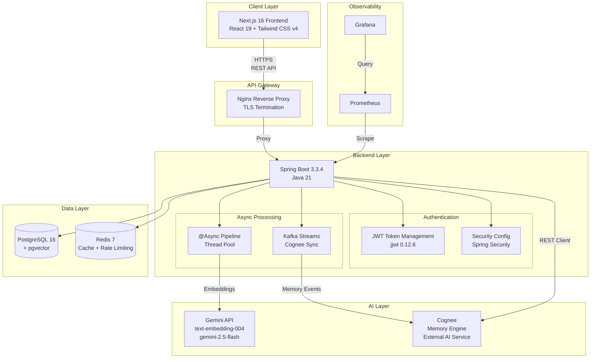

# System Architecture

**Diagram 1: System Architecture** — High-level overview of the Memory Engine platform. A Next.js 16 frontend communicates via HTTPS through an Nginx reverse proxy to a Spring Boot 3.3.4 backend. The backend handles authentication via JWT, processes transcripts asynchronously, generates embeddings via Gemini API, syncs with the Cognee external memory service over Kafka, and persists data to PostgreSQL 16 (with pgvector) while using Redis 7 for caching, rate limiting, and token blacklisting. Prometheus and Grafana provide observability.
