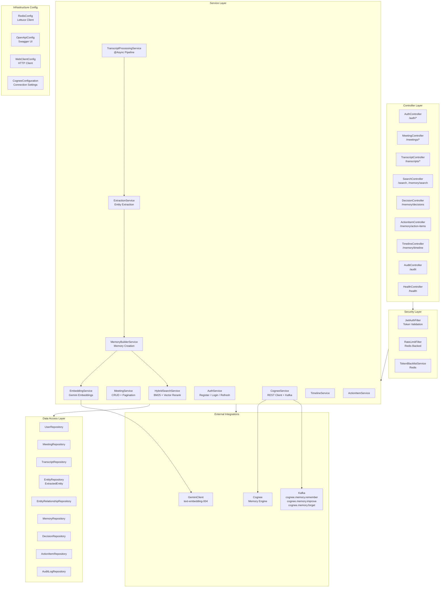

# Backend Architecture

**Diagram 2: Backend Architecture** — Spring Boot layered architecture. Controllers handle HTTP requests through security filters (JWT validation, Redis-backed rate limiting). The service layer orchestrates business logic, including the async transcript processing pipeline (extraction → memory building → embedding generation). The hybrid search service combines BM25 (tsvector) with vector cosine similarity. Cognee integration uses both REST and Kafka events. Configuration classes manage Redis, Swagger/OpenAPI, HTTP clients, and Cognee connection settings.
