# Cognee Memory Pipeline

```mermaid
graph LR
    subgraph Input["Input Sources"]
        A["Meeting Recording<br/>Audio / Video"]
        B["Document Upload<br/>PDF / Text"]
    end

    subgraph Stage1["1. Ingestion"]
        C["Transcript Generation<br/>Speech-to-Text"]
        D["Raw Text Storage<br/>transcripts Table"]
    end

    subgraph Stage2["2. Entity Extraction"]
        E["ExtractionService<br/>Regex + Tech Vocabulary"]
        F["Extracted Entities<br/>Person / Organization / Product<br/>Date / Technology / Project"]
        G["Entity Relationships<br/>Source → Target Mapping<br/>Relationship Type"]
    end

    subgraph Stage3["3. Memory Building"]
        H["MemoryBuilderService<br/>Memory Classification"]
        I["Memory Types<br/>DECISION / ACTION_ITEM<br/>FACT / COMMITMENT<br/>DISCUSSION"]
    end

    subgraph Stage4["4. Embedding Generation"]
        J["EmbeddingService<br/>Gemini text-embedding-004"]
        K["Vector Embeddings<br/>768 Dimensions<br/>pgvector Storage"]
    end

    subgraph Stage5["5. Semantic Indexing"]
        L["HybridSearchService<br/>BM25 + Vector Rerank"]
        M["TSVector Index<br/>Full-Text Search<br/>GIN Indexed"]
        N["IVFFlat Index<br/>Approximate Nearest<br/>Neighbor Search"]
    end

    subgraph Stage6["6. Cognee Sync"]
        O["CogneeService<br/>REST + Kafka Events"]
        P["Cognee External<br/>Memory Engine"]
        Q["Knowledge Graph<br/>Entity Relationships<br/>Connected Insights"]
    end

    subgraph Stage7["7. Enterprise Intelligence"]
        R["Semantic Search<br/>Natural Language Queries"]
        S["Knowledge Graph<br/>Relationship Discovery"]
        T["Decision Tracking<br/>Audit Trail"]
        U["Enterprise Dashboard<br/>Analytics & Insights"]
    end

    A --> C
    B --> C
    C --> D
    D --> E
    E --> F
    E --> G
    F --> H
    G --> H
    H --> I
    I --> J
    J --> K
    K --> L
    D --> L
    L --> M
    L --> N
    K --> O
    I --> O
    O --> P
    P --> Q
    M --> R
    N --> R
    Q --> S
    I --> T
    R --> U
    S --> U
    T --> U
```

**Diagram 4: Cognee Memory Pipeline** — End-to-end flow from raw input to enterprise intelligence. Sources (meetings, documents) are ingested as transcripts. The ExtractionService applies rule-based extraction (regex + technology vocabulary) to identify entities and relationships. The MemoryBuilderService classifies memories into five types. EmbeddingService generates 768-dimensional vectors via Gemini API and stores them in pgvector. HybridSearchService indexes content with both BM25 (tsvector GIN index) and vector similarity (IVFFlat index). Cognee syncs via REST and Kafka events for external memory graph enrichment. The final stage delivers semantic search, knowledge graph exploration, decision tracking, and dashboard analytics.
