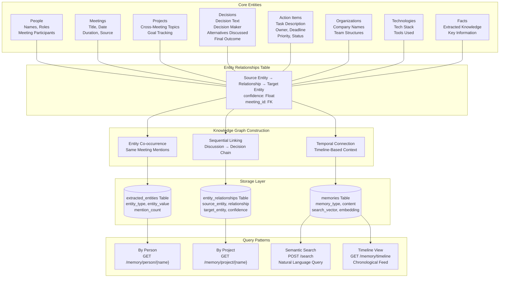

# Knowledge Graph Architecture

**Diagram 5: Knowledge Graph** — The knowledge graph connects eight entity types (People, Meetings, Projects, Decisions, Action Items, Organizations, Technologies, Facts) through a dedicated `entity_relationships` table. Each relationship stores source/target entities, relationship type, confidence score, and the originating meeting. The graph is constructed through entity co-occurrence analysis, sequential decision-action linking, and temporal connections across the timeline. Query patterns include person-based, project-based, semantic, and chronological retrieval.
