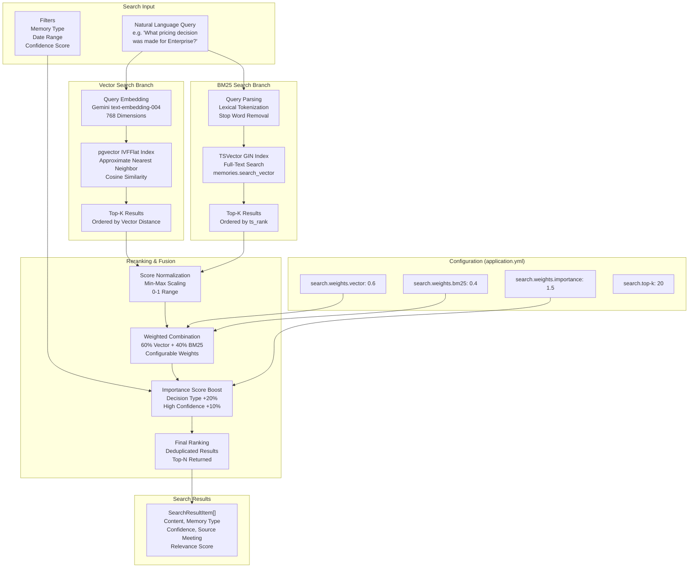

# Semantic Search Architecture

**Diagram 6: Semantic Search** — Hybrid search architecture combining vector similarity and BM25 full-text search. The vector branch embeds the query via Gemini and searches the pgvector IVFFlat index using cosine similarity. The BM25 branch tokenizes the query and searches the tsvector GIN index. Results are normalized, combined using configurable weights (default 60% vector, 40% BM25), and boosted by importance score (decisions +20%, high-confidence +10%). The final ranked list is deduplicated and returned as `SearchResultItem[]`.
