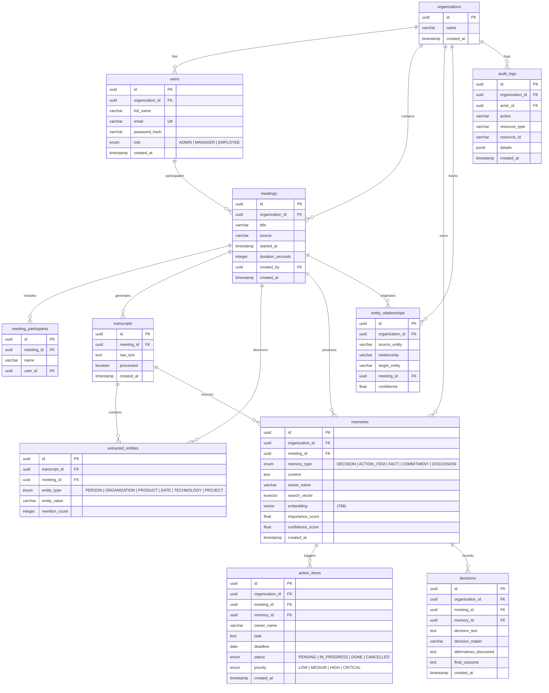

# Database Entity-Relationship Diagram

**Diagram 7: Database ER Diagram** — Complete entity-relationship model across 11 tables. The schema uses UUID primary keys, organizations for multi-tenancy, and pgvector's `vector(768)` type for embeddings. Key relationships show the meeting-to-memory pipeline, entity extraction graph, and action item/decision tracking. The `memories` table has both a `tsvector` (GIN-indexed for BM25) and `embedding` (IVFFlat-indexed for vector search) column for hybrid search. Audit logs capture all mutations with JSONB detail storage.
