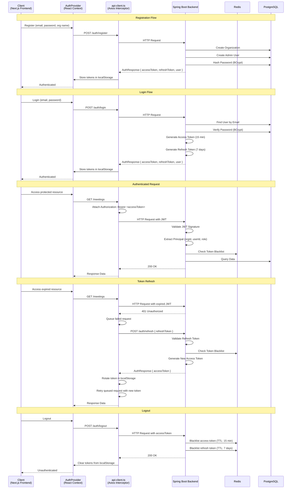

# Authentication Flow

**Diagram 8: Authentication Flow** — Complete JWT-based authentication sequence. Registration creates an organization and admin user. Login returns an access token (15-minute expiry) and refresh token (7-day expiry). Authenticated requests attach the JWT in the Authorization header; the backend validates the signature, extracts the principal (org/user/role), and checks Redis for blacklisted tokens. On 401, the Axios interceptor automatically refreshes the token using the refresh token, retries the queued request, and rotates the stored token. Logout blacklists both tokens in Redis with TTL matching their original expiry.
