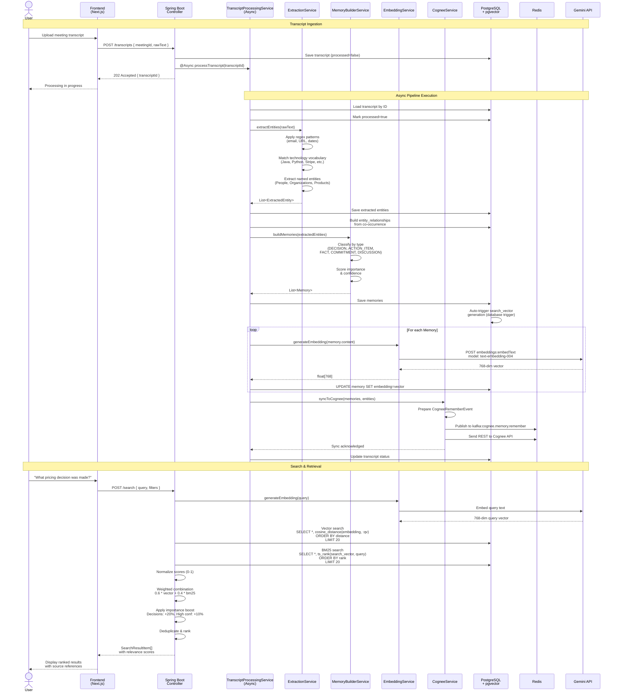

# Memory Pipeline Sequence Diagram

**Diagram 9: Memory Pipeline Sequence** — Complete end-to-end sequence from transcript ingestion to semantic search. The user uploads a transcript, which triggers an `@Async` pipeline: entity extraction (regex + tech vocabulary), memory building (classification + scoring), embedding generation (Gemini API, 768 dimensions stored in pgvector), and Cognee synchronization (Kafka + REST). The search flow embeds the user's query, performs hybrid BM25 + vector search, reranks with configurable weights and importance boosts, and returns deduplicated results.
