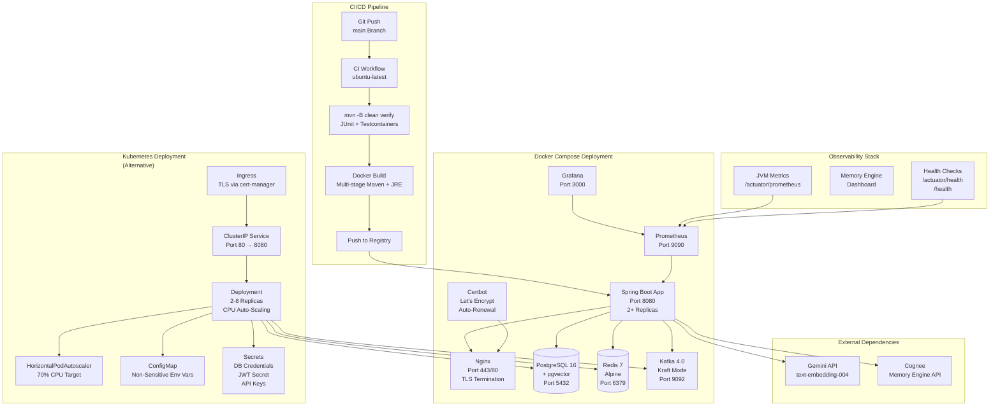

# Deployment Architecture

**Diagram 10: Deployment Architecture** — Two deployment options: Docker Compose (development/staging) and Kubernetes (production). The CI pipeline builds and tests the application with Testcontainers, produces a multi-stage Docker image (Maven build → JRE runtime), and pushes to a container registry. Docker Compose orchestrates all services including PostgreSQL 16 (pgvector), Redis 7, Kafka 4.0 (Kraft mode), Prometheus, Grafana, and an Nginx reverse proxy with Let's Encrypt TLS. The Kubernetes option adds auto-scaling (2-8 pods, 70% CPU), ConfigMap for environment variables, and secrets for sensitive credentials. Both configurations connect to external Gemini and Cognee APIs.
